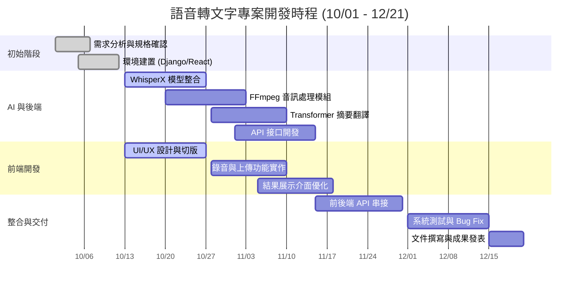

## 📅 專案時程與任務分配 (Project Schedule & Tasks)

### 1. 👥 團隊成員任務分配 (Team Roles)

| 成員 | 角色 (Role) | 負責內容 (Responsibilities) |
| :--- | :--- | :--- |
| **林東毅** | **AI & Backend Core** | • WhisperX 模型整合與優化<br>• Transformer 摘要與翻譯實作<br>• 撰寫 AI 處理邏輯 (Service Layer) |
| **張恩豪** | **Frontend (React)** | • React 專案架構與 UI 切版<br>• 開發錄音、檔案上傳與結果顯示介面<br>• RWD 行動端適配與互動優化 |
| **蘇子皓** | **DevOps & Integration** | • Django 環境建置與 DRF API 接口開發<br>• FFmpeg 音訊預處理串接<br>• 系統整合、除錯與最終部署 |

---

### 2. 📊 專案甘特圖 (Gantt Chart)


### 3. 🕸️ 專案 PERT/CPM 網絡圖
> 說明：**紅色框線**代表關鍵路徑，其餘為一般任務。
```mermaid
graph TD
    
    classDef critical fill:#fff,stroke:#d32f2f,stroke-width:3px,color:#d32f2f;
    
    %% 一般任務 (Normal): 藍框、白底、黑字
    classDef normal fill:#fff,stroke:#1976d2,stroke-width:1px,color:#000;
    
    %% 起訖點: 灰色填充
    classDef start_end fill:#eee,stroke:#333,stroke-width:1px,stroke-dasharray: 3 3,color:#000;

    %% --- 節點定義 (全中文版) ---
    
    Start((專案開始<br/>10/01)):::start_end
    End((專案結束<br/>12/21)):::start_end

    %% 關鍵路徑節點
    A["<b>A. 需求分析</b><br/>工期: 7天<br/>10/01 - 10/07"]:::critical
    B["<b>B. 環境建置</b><br/>工期: 8天<br/>10/05 - 10/12"]:::critical
    C["<b>C. WhisperX 整合</b><br/>工期: 15天<br/>10/13 - 10/27"]:::critical
    E["<b>E. Transformer 翻譯</b><br/>工期: 14天<br/>10/28 - 11/10"]:::critical
    F["<b>F. API 接口開發</b><br/>工期: 15天<br/>11/01 - 11/15"]:::critical
    I["<b>I. 前後端串接</b><br/>工期: 16天<br/>11/15 - 11/30"]:::critical
    J["<b>J. 系統測試</b><br/>工期: 15天<br/>12/01 - 12/15"]:::critical
    K["<b>K. 文件與交付</b><br/>工期: 7天<br/>12/15 - 12/21"]:::critical

    %% 一般路徑節點
    D["<b>D. FFmpeg 處理</b><br/>工期: 15天<br/>10/20 - 11/03"]:::normal
    G["<b>G. 前端 UI 設計</b><br/>工期: 15天<br/>10/13 - 10/27"]:::normal
    H["<b>H. 前端功能實作</b><br/>工期: 14天<br/>10/28 - 11/10"]:::normal

    %% --- 連線定義 ---
    %% 這裡的順序對應下方的 linkStyle，請勿隨意調換順序
    
    Start --> A
    A --> B
    
    B --> C
    B --> D
    B --> G
    
    C --> E
    D --> F
    E --> F
    
    G --> H
    H --> I
    
    F --> I
    
    I --> J
    J --> K
    K --> End

    %% --- 樣式應用 (紅色箭頭表示關鍵路徑) ---
    %% 對應上方連線的順序 (0, 1, 2, 5, 7, 10, 11, 12, 13)
    linkStyle 0,1,2,5,7,10,11,12,13 stroke:#d32f2f,stroke-width:3px;
