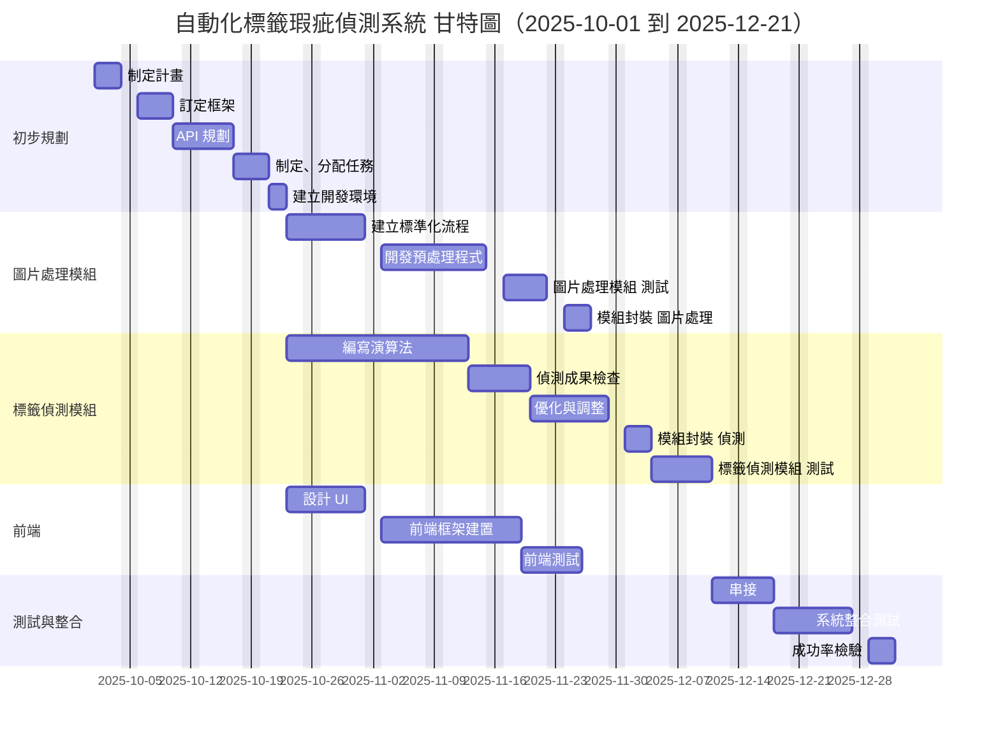
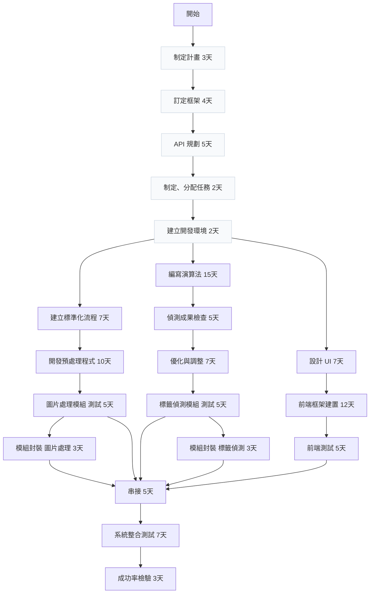

## 專題任務規劃
| 任務類別 | 任務編號 | 任務名稱 | 前置任務 | 需時（工作天） |
|---|---:|---|---|---:|
| 初步規劃 | 1.1 | 制定計畫 | 無 | 3 |
| 初步規劃 | 1.2 | 訂定框架 | 1.1 | 4 |
| 初步規劃 | 1.3 | API 規劃 | 1.2 | 5 |
| 初步規劃 | 1.4 | 制定、分配任務 | 1.3 | 2 |
| 初步規劃 | DEV | 建立開發環境 | 1.4 | 2 |
| 圖片處理模組 | 2.1 | 建立標準化流程 | DEV | 7 |
| 圖片處理模組 | 2.2 | 開發預處理程式 | 2.1 | 10 |
| 圖片處理模組 | 2.3 | 圖片處理模組 測試 | 2.2 | 5 |
| 圖片處理模組 | 2.4 | 模組封裝 圖片處理 | 2.3 | 3 |
| 標籤偵測模組 | 3.1 | 編寫演算法 | DEV | 15 |
| 標籤偵測模組 | 3.2 | 偵測成果檢查 | 3.1 | 5 |
| 標籤偵測模組 | 3.3 | 優化與調整 | 3.2 | 7 |
| 標籤偵測模組 | 3.4 | 標籤偵測模組 測試 | 3.3 | 3 |
| 標籤偵測模組 | 3.5 | 模組封裝 標籤偵測 | 3.4 | 5 |
| 前端 | 4.1 | 設計 UI | DEV | 7 |
| 前端 | 4.2 | 前端框架建置 | 4.1 | 12 |
| 前端 | 4.3 | 前端測試 | 4.2 | 5 |
| 測試與整合 | 5.1 | 串接 | 2.3, 2.4, 3.4, 3.5, 4.3 | 5 |
| 測試與整合 | 5.2 | 系統整合測試 | 5.1 | 7 |
| 測試與整合 | 5.3 | 成功率檢驗 | 5.2 | 3 |
## 任務項目分工
| 成員 | 負責任務（項目） |
|---|---|
|組長| 會議主導、API 規劃、制定分配任務、建立開發環境、串接、系統整合測試、成功率檢驗|
| 組員A | 建立標準化流程、開發預處理程式、圖片處理模組測試、模組封裝、（協助）標籤偵測模組串接 | 
|組員B | 編寫演算法、偵測成果檢查、優化與調整、模組封裝、標籤偵測模組 測試 |
| 組員C |  設計 UI、前端框架建置、前端測試、（協助）串接支援/API 整合| 
## 專題甘特圖

## PERT/CRM圖

