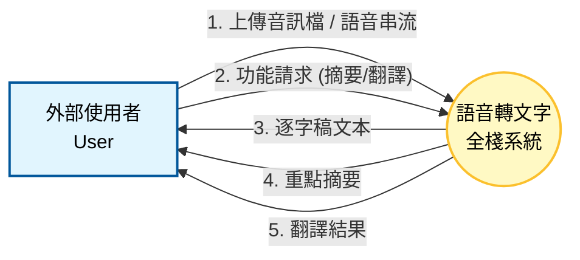
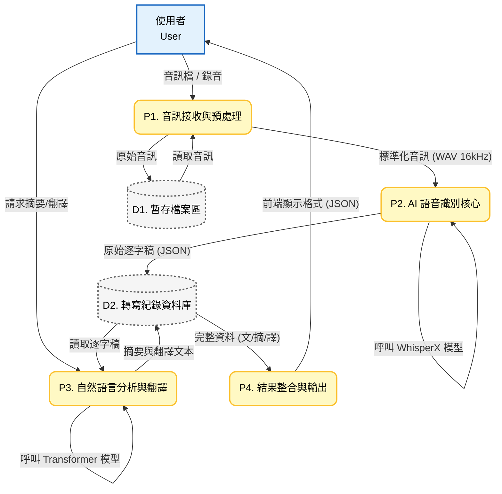

## 🔄 系統資料流程圖 

本章節使用 DFD 圖表來描述語音轉文字系統的資料流向，包含系統邊界與內部程序細節。

### 1. 系統環境圖

### 2.DFD 圖0 

* **程序說明 (Process Description)**
>P1. 音訊接收與預處理：負責接收前端上傳的檔案，並利用 FFmpeg 進行格式轉換、降噪與取樣率調整 (Resampling)。

>P2. AI 語音識別核心：將處理過的音訊輸入至 WhisperX 模型，輸出帶有時間戳記的逐字稿。

>P3. 自然語言分析與翻譯：根據使用者需求，調用 Transformer 模型針對逐字稿進行重點摘要提取或多語言翻譯。

>P4. 結果整合與輸出：將所有生成的文字資料包裝成前端可讀的 API 格式 (JSON) 並回傳。
