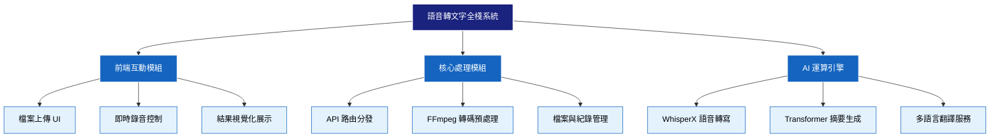
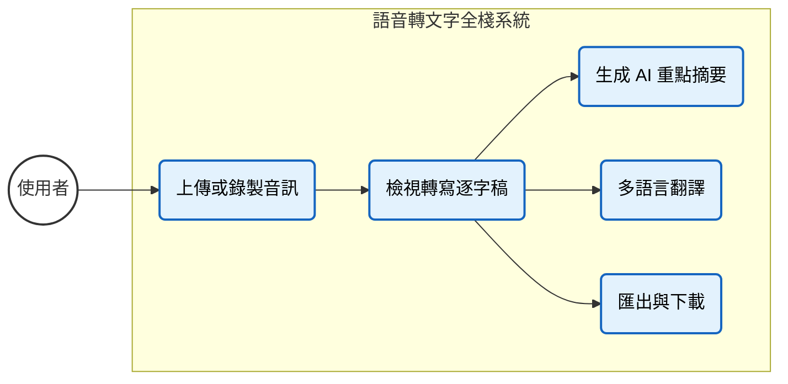

## 1. 📋 需求規格

### 1.1 功能性需求 

| 編號 | 需求名稱 | 詳細說明 |
| :--- | :--- | :--- |
| **FR-01** | **音訊處理與轉寫** | 系統需支援使用者上傳音訊檔或進行即時錄音，並利用 WhisperX 模型將語音精準轉換為文字逐字稿。 |
| **FR-02** | **AI 重點摘要** | 系統需具備自然語言處理能力，針對轉寫後的長篇文本自動提取關鍵資訊，生成條列式的重點摘要。 |
| **FR-03** | **多語言翻譯** | 系統需提供翻譯功能，允許使用者將轉寫內容或摘要翻譯成指定語言 (如中、英、日)，並支援原文與譯文對照檢視。 |

### 1.2 非功能性需求

| 編號 | 需求名稱 | 詳細說明 |
| :--- | :--- | :--- |
| **NFR-01** | **系統回應效能** | 對於 1 分鐘內的短音訊，轉寫處理時間應低於 **10 秒**；即時語音辨識的延遲時間應控制在 **2 秒** 以內。 |
| **NFR-02** | **跨平台相容性** | 前端介面需採用響應式設計，確保在 Desktop 與 Mobile (iOS/Android) 瀏覽器上皆能完整操作。 |
| **NFR-03** | **辨識準確度** | 在一般室內環境 (背景噪音 < 50dB) 下，語音轉文字的字詞錯誤率 應低於 **10%**。 |

---

## 2. 🧩 功能分解圖 (FDD)
下圖展示系統由上而下的模組拆解結構。

## 3. 使用者案例分析 

本章節描述使用者與系統之間的核心互動流程，包含「音訊轉寫」、「AI 摘要」與「多語言翻譯」三大核心功能。

### 3.1. 系統使用案例圖 
下圖展示了使用者可執行的操作以及各功能之間的相依關係。

### 3.2. 詳細使用案例說明

以下表格詳細定義了系統核心功能的操作流程、條件與例外狀況。

#### 📄 音訊上傳與即時轉寫

| 項目 | 內容說明  |
| :--- | :--- |
| **使用案例名稱** | **音訊上傳與即時轉寫** |
| **參與者 ** | 一般使用者|
| **前置條件** | 1. 使用者已進入網站首頁。 2. 後端 API 與 WhisperX 模型服務運作正常。 |
| **基本流程** | 1. 使用者點擊「上傳檔案」按鈕或點擊「開始錄音」。 2. 系統前端顯示上傳進度或錄音波形。 3. 上傳完成後，後端自動執行 FFmpeg 降噪與轉碼。 4. 系統呼叫 WhisperX 模型進行語音轉文字。 5. 系統回傳 JSON 格式逐字稿，並顯示於前端頁面。 |
| **例外流程** | **格式錯誤**： 若上傳非音訊檔，系統彈出警告：「不支援的檔案格式」，並重置上傳區塊。 **A2. 檔案過大**： 若檔案超過 50MB，系統提示：「檔案過大，請壓縮後再試」。 |
| **後置條件** | 畫面顯示完整的語音逐字稿，且資料已暫存於資料庫中。 |

 

#### 📝 重點摘要生成

| 項目 | 內容說明|
| :--- | :--- |
| **使用案例名稱** | **生成重點摘要** |
| **參與者** | 一般使用者|
| **前置條件** | **UC-01** 已執行完畢，且畫面上已有轉寫後的文本內容。 |
| **基本流程** | 1. 使用者檢視文本後，點擊「生成摘要」按鈕。 2. 系統將文本發送至 Transformer 摘要模型。 3. 模型分析語意，提取關鍵資訊。 4. 系統回傳摘要結果。 5. 前端於介面上（如側邊欄或底部）顯示條列式重點摘要。 |
| **例外流程** | **內容過短**： 若原文少於 50 字，系統提示：「內容不足以生成摘要」，不執行運算。 |
| **後置條件** | 使用者可閱讀摘要內容，並可進行複製或儲存。 |

 

#### 🌍：多語言翻譯服務

| 項目| 內容說明 |
| :--- | :--- |
| **使用案例名稱** | **多語言翻譯** |
| **參與者** | 一般使用者 |
| **前置條件** | 畫面顯示轉寫文本或摘要內容。 |
| **基本流程** | 1. 使用者於下拉選單選擇目標語言（例如：English, Japanese）。 2. 使用者點擊「翻譯 」按鈕。 3. 系統呼叫翻譯模型處理當前文本。 4. 系統回傳翻譯後的文字。 5. 前端以「雙欄對照」或「覆蓋」方式顯示翻譯結果。 |
| **例外流程** | **服務連線逾時**： 若翻譯請求超過 15 秒無回應，系統顯示：「翻譯服務忙碌中，請稍後再試」。 |
| **後置條件** | 畫面顯示目標語言的內容，使用者可隨時切換回原文。 |
