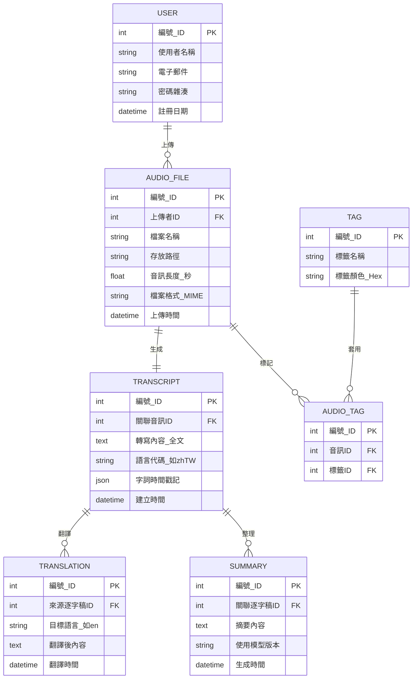

## 🗄️ 資料庫實體關係圖 (ERD)

系統資料庫的邏輯設計

### 1. 組合實體說明
本系統包含以下兩個多對多或依賴型的組合實體：

1.  **翻譯紀錄**
    * **組成**：由「原始逐字稿」與「目標語言」共同定義。
    * **用途**：解決一份文件對應多種語言版本的需求。
2.  **音訊標籤關聯**
    * **組成**：由「音訊檔」與「標籤」組成。
    * **用途**：處理多對多關係，讓一個音訊可擁有多個標籤（如：會議、重要），一個標籤也可套用到多個音訊。

---

### 2. 系統 ERD 圖表 
> **圖例說明**：
> * `PK`：主鍵
> * `FK`：外鍵
> * `string`, `int`, `datetime`：資料型態

